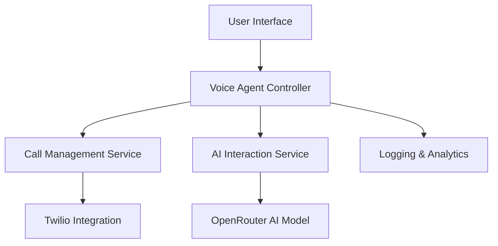

# Pola Sistem Voice Agent

## Arsitektur Utama


## Pola Desain
1. Event-Driven Architecture
   - Menggunakan Socket.IO untuk komunikasi real-time
   - Event handler untuk status panggilan
   - Decoupled communication antara komponen

2. Retry & Fallback Pattern
   - Mekanisme retry untuk panggilan dan TTS
   - Fallback ke metode alternatif jika gagal
   - Implementasi exponential backoff

3. State Machine untuk Panggilan
   - Manajemen status panggilan yang kompleks
   - Transisi status yang jelas
   ```mermaid
   stateDiagram-v2
       [*] --> Queued
       Queued --> Ringing
       Ringing --> Connected
       Connected --> Completed
       Connected --> Failed
       Failed --> [*]
       Completed --> [*]
   ```

## Strategi Modularitas
- Pemisahan concerns antara:
  - Antarmuka pengguna
  - Logika panggilan
  - Integrasi AI
  - Manajemen status

## Mekanisme Konfigurasi
- Konfigurasi agent yang fleksibel
- Dukungan multi-model AI
- Templating untuk greeting

## Pertimbangan Performa
- Lazy loading untuk komponen berat
- Caching untuk konfigurasi
- Optimasi permintaan API
- Manajemen memori yang efisien

## Pola Keamanan
- Input sanitization
- Rate limiting
- Enkripsi data sensitif
- Validasi token

## Strategi Logging & Monitoring
- Pencatatan detail percakapan
- Pelacakan status panggilan
- Analitik percakapan
- Deteksi anomali 