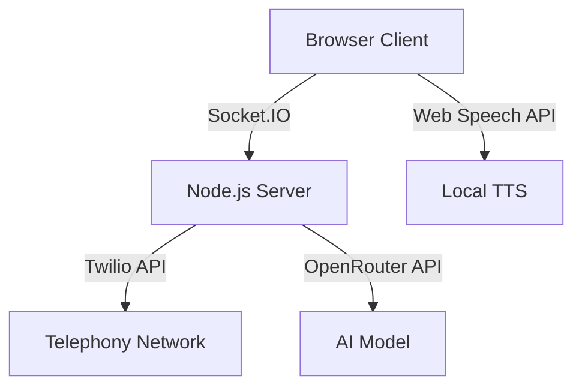

# Konteks Teknologi Voice Agent

## Teknologi Utama
- **Backend**: Node.js dengan Express.js
- **Frontend**: Vanilla JavaScript, Bootstrap
- **Real-time Communication**: Socket.IO
- **Telephony**: Twilio API
- **AI Integration**: OpenRouter AI
- **Text-to-Speech**: Web Speech API, browser-based TTS

## Arsitektur Sistem

## Integrasi Kunci
1. Twilio
   - Manajemen panggilan telepon
   - Kontrol status panggilan
   - Dukungan multi-saluran

2. OpenRouter
   - Akses multi-model AI
   - Fleksibilitas model AI
   - Dukungan berbagai bahasa

3. Web Speech API
   - Text-to-Speech lokal
   - Fallback untuk TTS server

## Dependensi Utama
- `express`: Kerangka web server
- `socket.io`: Komunikasi real-time
- `twilio`: Integrasi layanan telepon
- `axios`: Permintaan HTTP
- `dotenv`: Manajemen konfigurasi

## Pertimbangan Performa
- Mekanisme retry untuk panggilan
- Manajemen status panggilan yang robust
- Optimasi beban server
- Fallback mechanism untuk integrasi

## Keamanan
- Enkripsi data sensitif
- Validasi input
- Pembatasan akses API
- Manajemen token dengan aman

## Skalabilitas
- Arsitektur berbasis event
- Dukungan panggilan batch
- Desain modular
- Kemampuan horizontal scaling 